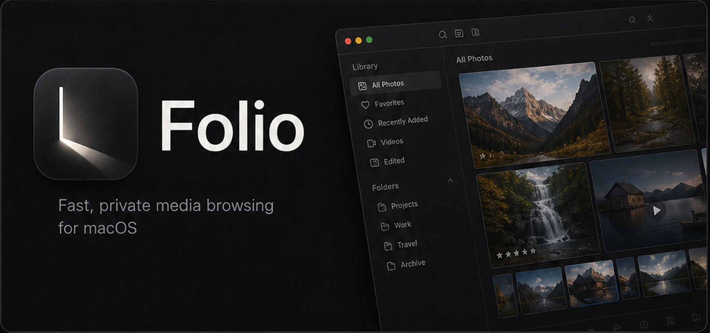

# Folio



A lightweight photo and video viewer built in rust.

Folio is a high-performance, macOS-native media viewer. It uses Tauri for its architecture, leveraging a native Rust backend for lightning-fast media decoding and a modern Vanilla JS/CSS frontend for a polished UI.

## Features

- **Blazing Fast I/O**: Multi-threaded metadata extraction and aggressive caching via SQLite WAL mode.
- **Media Support**: Full native support for JPG, PNG, WEBP, AVIF, TIFF, GIF, and chunked streaming for video files (MP4, MOV, MKV).
- **Editorial Metadata Overlay**: Press `I` to bring up a beautiful frosted glass overlay with EXIF data (Aperture, Shutter, ISO, Focal Length).
- **Customizable Keybindings**: Fully customizable shortcuts and mouse modifiers via the Settings menu.
- **Native macOS Feel**: Cinematic hardware-accelerated mesh gradient backgrounds, dynamic color tinting based on the active image, and custom magnetic cursors.
- **Precise Zoom**: Buttery smooth, customizable `Shift+Scroll` variable zoom that perfectly tracks the cursor with drag panning.
- **Simple Photo Editing**: Non-destructive adjustments for Brightness and Vibrance, plus instant Horizontal/Vertical flipping.

- **Full-Screen Media Catalog**: A zoomable grid view with thumbnail shimmer loading, multi-select (⇧/⌘+Click), batch format transcoding (WebP, PNG, JPEG, AVIF, TIFF), duplicate detection via perceptual hashing, and inline folder creation.
- **Tag Filtering**: Sidebar tag filter panel with color-coded chips to isolate images by custom tags.
- **GPS Map Popup**: Tap EXIF GPS coordinates to launch an inline map view of the image's capture location.
- **Format Transcoding**: Batch convert selected images between WebP, PNG, JPEG, AVIF, and TIFF directly from the catalog grid.
- **Duplicate Finder**: Perceptual hash-based visual similarity detection to flag duplicate or near-duplicate images.
- **Accessibility Color Simulator**: Real-time Protanopia, Deuteranopia, and Tritanopia filters for designers auditing assets.
- **Export Watermarking**: Optional text watermark overlay applied dynamically on image export.
- **Custom SVG Icon System**: Every icon in the app uses crisp, consistent inline SVGs — no emoji fallbacks.
- **Window Vibrancy**: Optional macOS-native window transparency and background tinting.
- **Secure Album Vault**: Touch ID-gated encrypted vault storage for sensitive media, backed by macOS Keychain key material where available.
- **Smart Catalog Workflows**: Ratings, favorites, smart filters, saved smart albums, sidecar metadata export/import, and job-tracked batch operations.
- **Release-Grade Packaging**: macOS releases bundle `touchid_helper` (vault biometrics) and `folio_macos_helper` (Share Sheet, Vision tags, haptics, Live Photo preview).

## Install (macOS)

### "App is damaged and can't be opened" (macOS)
Because Folio is a free, open-source app, it is not cryptographically "notarized" using a paid Apple Developer account ($99/year). Because of this, modern macOS Gatekeeper intentionally marks the downloaded app as "damaged" to force developers into their paid ecosystem, completely hiding the "Open Anyway" button.

**The ONLY way to bypass Apple's block for free apps is a one-time terminal command:**
1. Drag the **Folio** app from the `.dmg` into your **Applications** folder.
2. Open your Mac's **Terminal** app.
3. Copy and paste this exact command and press Enter:
```bash
xattr -cr /Applications/Folio.app
```
This simply strips Apple's "quarantine" flag from the file. You will now be able to open Folio normally forever!
